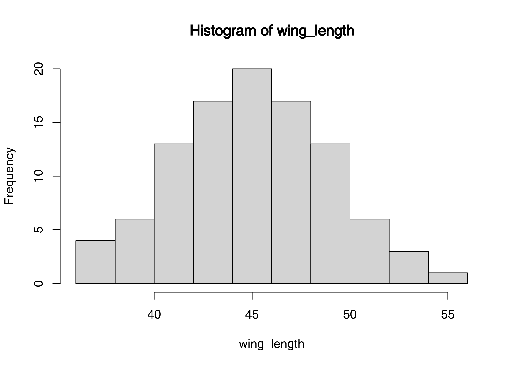

Use R and work through the Sokal and Rohlf’s Biometry, 3rd edition.
Create an R package for the datasets.

# Preface

“There is remarkably little correlation between innate mathematical
ability and capacity to understand the ordinary biometric methodologies.
By contrast, in our experience a very high correlation exists between
success in biometry course and success in the chosen field of biological
specialization.”

# 1 | Introduction

“There are still a few legitimate fields of inquiry in which, from the
nature of the phenomena studied, statistical investigation is
unnecessary. When all animals given injections of a pathogenic organisms
contract the disease, while none of the controls fall ill, statistical
testing is hardly needed. Much more frequent, however, are
investigations, such as those determining the relation betweens smoking
and heart disease, where the variability of the outcomes necessitates
statistical analysis.”

# 2 | Data in biology

Twenty-five femur lengths of stem mothers of the aphid *Pemphigus
populitransversus* in 0.1 mm.

Interorbital width of a 40 domestic pigeons (left) and the same data
log10 transformed (right).

# 3 | Handling of data

“The availability of computers relieves the tedium of computation, but
not the necessity to understand the methods being employed.”

# 4 | Descriptive statistics

# 6 | The normal probability distribution

# 7 | Estimation and hypothesis testing

The subject matter in this chapter is fundamental to an understanding of
all the subsequent chapters. It will provide methods to ask two common
and fundamental questions that all biologists must answer frequently in
their work: 1) how reliable are the results? 2) how probably is it that
the differences between observed and expected are due to change alone?
